# JFXENGINE

## AI-Powered MBSE 3D Visualization, Simulation & Digital Engineering Platform

[](https://github.com/sdk2035/jfxengine)
[](https://github.com/sdk2035/jfxengine)
[](https://github.com/sdk2035/jfxengine)
[](https://github.com/sdk2035/jfxengine)
[](https://github.com/sdk2035/jfxengine)

> Unified open-source architecture and software dependency compendium for AI-assisted Model-Based Systems Engineering, 3D visualization, simulation, digital twins and virtual testing.


**Repository status:** this snapshot contains architecture documentation and editable
Draw.io assets. The integrations and diagrams below describe proposed capabilities;
no application source, build manifest or deployable service is included yet.

- [Documentation index and migration register](docs/README.md)
- [Four-phase engineering delivery plan](docs/roadmap/four-phase-engineering-delivery-plan.md)
- [Domain ingestion pipeline specification](docs/architecture/domain-ingestion-pipelines.md)

Mermaid diagrams use labeled components, review points and feedback loops. They
are conceptual views, not executable models or proof of integration. File trees
remain text; technology inventories use ordinary lists.

---

## Table of Contents

1. [Overview](#1-overview)
2. [Project Context](#2-project-context)
3. [Objectives](#3-objectives)
4. [Functional Scope](#4-functional-scope)
5. [Engineering Lifecycle](#5-engineering-lifecycle)
6. [Conceptual Architecture](#6-conceptual-architecture)
7. [AI-Powered Engineering Intelligence](#7-ai-powered-engineering-intelligence)
8. [MBSE Architecture](#8-mbse-architecture)
9. [3D Visualization Architecture](#9-3d-visualization-architecture)
10. [Simulation and Digital Twin](#10-simulation-and-digital-twin)
11. [Open-Source Software Dependency Compendium](#11-open-source-software-dependency-compendium)
12. [Dependency Classification](#12-dependency-classification)
13. [Dependency Specification Template](#13-dependency-specification-template)
14. [Dependency Matrix](#14-dependency-matrix)
15. [Recommended Technology Stack](#15-recommended-technology-stack)
16. [Data Architecture](#16-data-architecture)
17. [SysML / Model Transformation](#17-sysml--model-transformation)
18. [CAD / CAM / CAS Integration](#18-cad--cam--cas-integration)
19. [Digital Twin Architecture](#19-digital-twin-architecture)
20. [Virtual Testing and Validation](#20-virtual-testing-and-validation)
21. [Repository Structure](#21-repository-structure)
22. [Installation Guide](#22-installation-guide)
23. [Development Workflow](#23-development-workflow)
24. [Security](#24-security)
25. [Responsible AI](#25-responsible-ai)
26. [Roadmap](#26-roadmap)
27. [Contribution](#27-contribution)
28. [Governance](#28-governance)
29. [License](#29-license)
30. [Strategic Vision](#30-strategic-vision)

---

## 1. Overview

JFXENGINE is an open-source research and engineering platform focused on integrating:

- Model-Based Systems Engineering (MBSE)
- SysML-based system models
- 3D visualization
- Simulation
- Digital twins
- Virtual testing
- CAD
- CAM
- Computer-Aided Simulation (CAS)
- Multiphysics engineering
- Physics-informed machine learning
- AI-assisted engineering
- Model transformation
- System architecture
- Real-time visualization

The current repository describes itself as an **AI-Powered MBSE 3D Visualization Platform** and includes resources covering SysML/3D integration, multibody simulation, digital twins, OpenUSD, OpenSCENARIO, engineering simulation, CAD, MBSE and model transformation.

The repository also organizes engineering resources according to the development lifecycle:

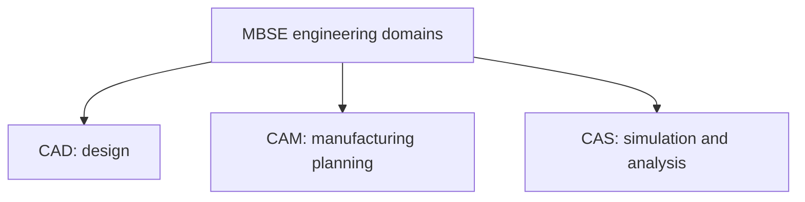
```mermaid
flowchart TB
    mbse["MBSE engineering domains"] --> cad["CAD: design"]
    mbse --> cam["CAM: manufacturing planning"]
    mbse --> cas["CAS: simulation and analysis"]
```

These are conceptual engineering domains. Only `MBSE/CAS/Drawio/` exists in this snapshot.

---

## 2. Project Context

JFXENGINE addresses the convergence of systems engineering, simulation and artificial intelligence.

The conceptual architecture is:

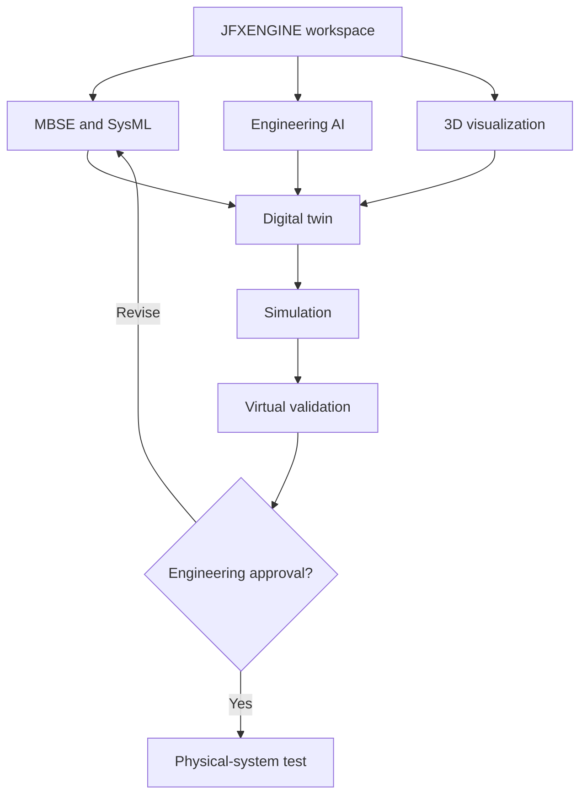
```mermaid
flowchart TB
    engine["JFXENGINE workspace"] --> mbse["MBSE and SysML"]
    engine --> ai["Engineering AI"]
    engine --> view["3D visualization"]
    mbse --> twin["Digital twin"]
    ai --> twin
    view --> twin
    twin --> sim["Simulation"]
    sim --> validation["Virtual validation"]
    validation --> review{"Engineering approval?"}
    review -->|Yes| physical["Physical-system test"]
    review -->|Revise| mbse
```

The goal is to create a common engineering environment where architecture models, physical models, simulation models and visualization models can exchange information.

---

## 3. Objectives

### 3.1 Engineering Objectives

- Integrate MBSE and 3D visualization.
- Connect SysML system architecture with simulation.
- Support virtual testing and validation.
- Integrate digital twins.
- Provide reusable open-source engineering components.
- Support CAD/CAM/CAS workflows.
- Enable AI-assisted engineering analysis.
- Support multiphysics simulation.
- Provide a foundation for autonomous engineering workflows.

### 3.2 Software Objectives

- Maintain a structured dependency catalog.
- Document licenses and versions.
- Establish reproducible environments.
- Define integration boundaries.
- Separate experimental and production dependencies.
- Provide clear installation procedures.
- Enable containerization.
- Support future Kubernetes deployment.

### 3.3 Research Objectives

JFXENGINE can serve as a research platform for:

- AI-assisted systems engineering.
- Generative engineering.
- Physics-informed AI.
- Digital engineering.
- Model transformation.
- Automated verification.
- Digital twins.
- Virtual commissioning.
- Engineering knowledge graphs.

---

## 4. Functional Scope

| Domain | Capability |
|---|---|
| MBSE | System architecture modeling |
| SysML | Requirements, blocks and behavior |
| 3D | Visualization and interaction |
| CAD | Geometry and product design |
| CAM | Manufacturing planning |
| CAS | Simulation and analysis |
| Digital Twin | Physical/virtual synchronization |
| Simulation | Physics and system simulation |
| AI | Engineering intelligence |
| ML | Surrogate and predictive models |
| NLP | Engineering documentation analysis |
| Knowledge Graph | Engineering relationships |
| Visualization | 2D/3D/VR/AR |
| Validation | Virtual testing |
| Optimization | Design-space exploration |

---

## 5. Engineering Lifecycle

JFXENGINE should model the complete engineering lifecycle:

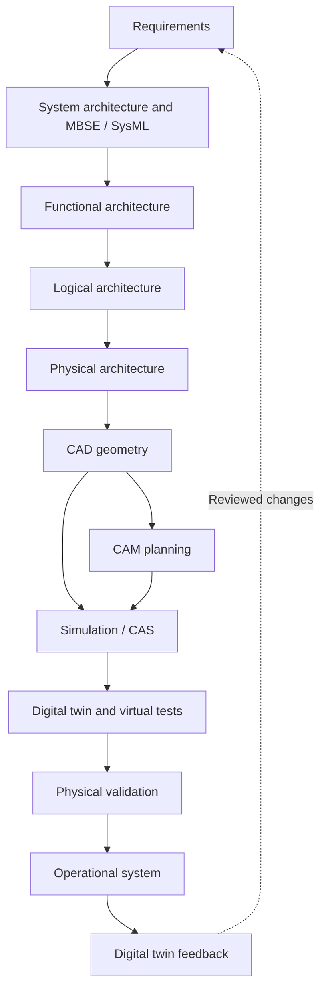
```mermaid
flowchart TB
    req["Requirements"] --> sys["System architecture and MBSE / SysML"]
    sys --> functional["Functional architecture"]
    functional --> logical["Logical architecture"]
    logical --> physical["Physical architecture"]
    physical --> cad["CAD geometry"]
    cad --> cam["CAM planning"]
    cad --> cas["Simulation / CAS"]
    cam --> cas
    cas --> twin["Digital twin and virtual tests"]
    twin --> validation["Physical validation"]
    validation --> operation["Operational system"]
    operation --> feedback["Digital twin feedback"]
    feedback -. Reviewed changes .-> req
```

The resulting system is a closed engineering feedback loop.

---

## 6. Conceptual Architecture

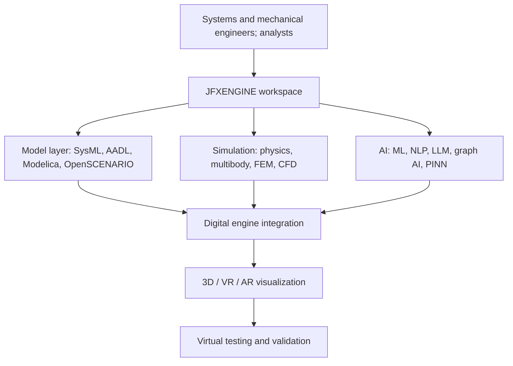
```mermaid
flowchart TB
    users["Systems and mechanical engineers; analysts"] --> workspace["JFXENGINE workspace"]
    workspace --> model["Model layer: SysML, AADL, Modelica, OpenSCENARIO"]
    workspace --> simulation["Simulation: physics, multibody, FEM, CFD"]
    workspace --> ai["AI: ML, NLP, LLM, graph AI, PINN"]
    model --> engine["Digital engine integration"]
    simulation --> engine
    ai --> engine
    engine --> display["3D / VR / AR visualization"]
    display --> test["Virtual testing and validation"]
```

---

## 7. AI-Powered Engineering Intelligence

AI should operate as an engineering assistant rather than replacing engineering authority.

### 7.1 AI Capabilities

Potential capabilities include:

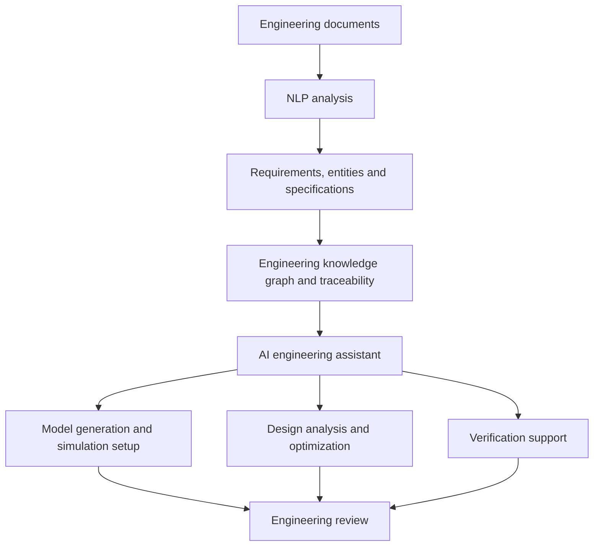
```mermaid
flowchart TB
    docs["Engineering documents"] --> nlp["NLP analysis"]
    nlp --> extraction["Requirements, entities and specifications"]
    extraction --> knowledgeGraph["Engineering knowledge graph and traceability"]
    knowledgeGraph --> assistant["AI engineering assistant"]
    assistant --> models["Model generation and simulation setup"]
    assistant --> analysis["Design analysis and optimization"]
    assistant --> verify["Verification support"]
    models --> review["Engineering review"]
    analysis --> review
    verify --> review
```

### 7.2 Engineering AI

Potential applications:

- Requirement classification.
- Requirement-to-model traceability.
- Automatic SysML assistance.
- Model transformation.
- Simulation parameter generation.
- Anomaly detection.
- Surrogate modeling.
- Optimization.
- Failure prediction.
- Design-space exploration.
- Engineering document retrieval.

---

## 8. MBSE Architecture

### 8.1 MBSE Domains

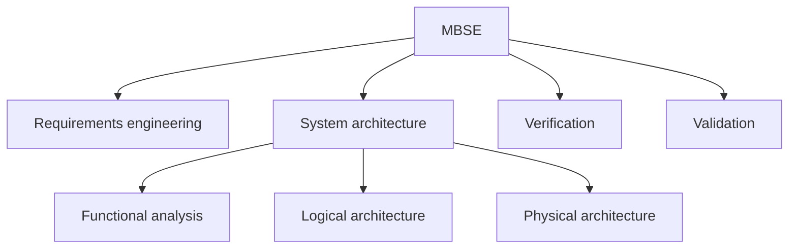
```mermaid
flowchart TB
    mbse["MBSE"] --> req["Requirements engineering"]
    mbse --> architecture["System architecture"]
    architecture --> functional["Functional analysis"]
    architecture --> logical["Logical architecture"]
    architecture --> physical["Physical architecture"]
    mbse --> verification["Verification"]
    mbse --> validation["Validation"]
```

The repository identifies Arcadia as a systems-engineering architecture approach supported by Capella and places it under the MBSE hierarchy.

---

### 8.2 SysML

JFXENGINE should support a model interoperability layer capable of representing:

- Requirements
- Blocks
- Interfaces
- Activities
- States
- Use Cases
- Parametrics
- Allocations
- Constraints
- Traceability

---

## 9. 3D Visualization Architecture

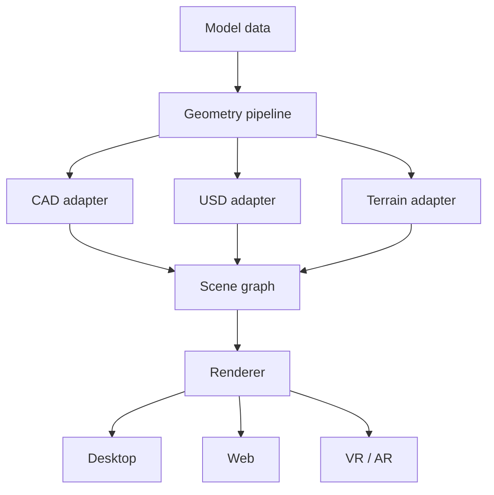
```mermaid
flowchart TB
    data["Model data"] --> pipeline["Geometry pipeline"]
    pipeline --> cad["CAD adapter"]
    pipeline --> usd["USD adapter"]
    pipeline --> terrain["Terrain adapter"]
    cad --> scene["Scene graph"]
    usd --> scene
    terrain --> scene
    scene --> renderer["Renderer"]
    renderer --> desktop["Desktop"]
    renderer --> web["Web"]
    renderer --> immersive["VR / AR"]
```

OpenUSD is particularly relevant as a common scene-description technology for complex 3D engineering and simulation environments.

---

## 10. Simulation and Digital Twin

### 10.1 Simulation Domains

The dependency ecosystem includes resources covering:

- Multibody systems.
- Structural mechanics.
- Computational mechanics.
- Physics simulation.
- Industrial control simulation.
- Aerospace simulation.
- Robotics.
- Terrain visualization.
- System simulation.
- Multiphysics.

The repository specifically references MBSim, Kratos Multiphysics, Chrono, SPHinXsys, Advanced Simulation Library and other simulation technologies.

---

### 10.2 Digital Twin

Conceptual architecture:

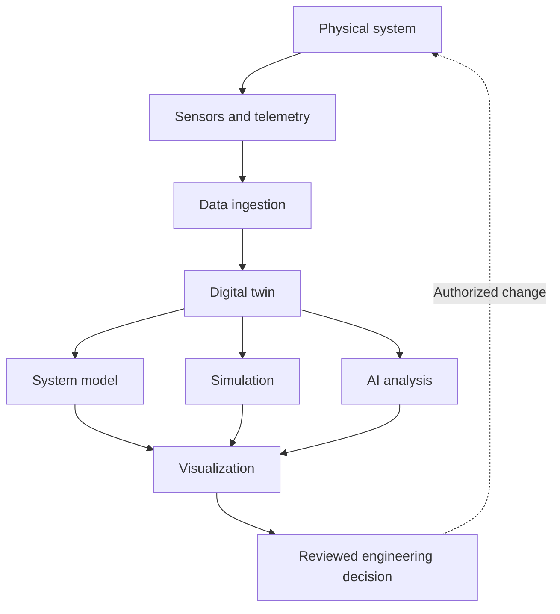
```mermaid
flowchart TB
    physical["Physical system"] --> telemetry["Sensors and telemetry"]
    telemetry --> ingest["Data ingestion"]
    ingest --> twin["Digital twin"]
    twin --> model["System model"]
    twin --> simulation["Simulation"]
    twin --> ai["AI analysis"]
    model --> view["Visualization"]
    simulation --> view
    ai --> view
    view --> decision["Reviewed engineering decision"]
    decision -. Authorized change .-> physical
```

---

## 11. Open-Source Software Dependency Compendium

The repository's current README already functions as a curated catalog of open-source engineering technologies. The purpose of this section is to normalize that catalog into a dependency-management architecture.

---

### 11.1 MBSE and Systems Engineering

| Software / Project | Primary Role | Category |
|---|---|---|
| Capella | Arcadia/MBSE | Core Candidate |
| Eclipse RCP | Engineering application platform | Platform |
| Open Source AADL Tool Environment (OSATE) | Architecture analysis | MBSE |
| Virtual Satellite | MBSE / aerospace systems | MBSE |
| SAMM | Semantic modeling | Modeling |
| Spar | System architecture model compiler | Transformation |
| POOSL | System specification | Modeling |
| OML Rosetta | Semantic/modeling environment | Modeling |

---

### 11.2 SysML / Model Transformation

| Software / Project | Role |
|---|---|
| SysML | Systems modeling |
| Modelica | Physical/system simulation |
| Acceleo | Model-to-code transformation |
| ATL | Model transformation |
| SysML-to-Modelica tooling | Engineering model transformation |
| sdf2modelica | Gazebo/SDF to Modelica conversion |

The repository explicitly references ATL/Acceleo transformation from SysML to Modelica and SDF-to-Modelica conversion.

---

### 11.3 3D Visualization

| Software / Project | Role |
|---|---|
| OpenUSD | Universal scene description |
| Modelica3D | 3D visualization |
| Fusion3D | Terrain visualization |
| VisIt | Scientific visualization |
| DLR Visualization Library 2 | Engineering visualization |
| JFXENGINE | Java/JavaFX-oriented visualization environment |

---

### 11.4 Simulation

| Software / Project | Role |
|---|---|
| MBSim | Multibody simulation |
| Kratos Multiphysics | Multiphysics simulation |
| Chrono | Multiphysics / dynamics |
| Advanced Simulation Library | Numerical simulation |
| SPHinXsys | Particle-based simulation |
| OptimiSM | Solid mechanics |
| Modelica | System simulation |
| Modelica3D | Visualization |
| POOSL | System modeling/simulation |

---

### 11.5 Computational Mechanics

| Software / Project | Role |
|---|---|
| PyVUMAT | ML material models for FEA |
| Physics-Informed Neural Networks | Physics-informed ML |
| OptimiSM | Solid mechanics |
| Kratos | Multiphysics |
| SPHinXsys | Meshfree/particle simulation |
| Chrono | Multibody and physics simulation |

The repository specifically identifies PyVUMAT as a package for developing and deploying machine-learning material models in finite-element simulations and includes physics-informed neural-network approaches for computational solid mechanics.

---

### 11.6 CAD

| Software / Project | Role |
|---|---|
| JSCAD | Parametric / programmatic CAD |
| BRL-CAD | Solid modeling |
| OpenUSD | 3D interchange |
| CAD integration layer | Engineering geometry |

---

### 11.7 CAM

CAM-related components should cover:

- Manufacturing planning.
- Toolpath generation.
- Part manufacturing.
- Assembly processes.
- CAD-to-CAM workflows.
- Digital manufacturing.

The repository defines CAM as dedicated to the part manufacturing and assembly process.

---

### 11.8 CAS

Computer-Aided Simulation should provide:

- Physical simulation.
- System simulation.
- Performance analysis.
- Design optimization.
- Virtual testing.
- Verification.

The repository describes CAS as the domain for simulation of end-to-end functionality and performance analysis.

---

### 11.9 Robotics and Physical AI

Potential integration technologies include:

| Technology | Role |
|---|---|
| Gazebo | Robotics simulation |
| ROS / ROS 2 | Robot middleware |
| OSMO | Physical AI workloads |
| Chrono | Robotics / dynamics |
| OpenSCENARIO | Scenario simulation |
| OpenUSD | 3D simulation environment |

The current repository explicitly references OSMO, OpenSCENARIO and conversion between Gazebo SDF and Modelica.

---

### 11.10 Scenario Simulation

OpenSCENARIO can provide a standardized representation for:

- Vehicles
- Actors
- Traffic
- Environment
- Scenarios
- Events
- Maneuvers
- Simulation Conditions

This enables scenario-driven virtual validation.

---

## 12. Dependency Classification

Every software component should be assigned a lifecycle classification.

| Classification | Description |
|---|---|
| Core | Required by the platform |
| Runtime | Required during execution |
| Build | Build-time dependency |
| Development | Developer tooling |
| Test | Testing |
| Optional | Feature-specific |
| Research | Experimental |
| Integration | External interoperability |
| Reference | Studied technology |
| Legacy | Historical dependency |
| Deprecated | No longer recommended |

---

## 13. Dependency Specification Template

Every dependency should have a standardized record.

```yaml
name:
category:
dependency_type:

purpose:

repository:
official_website:

license:
license_compatibility:

programming_language:
version_tested:

installation:

runtime_requirements:

build_requirements:

integration:
  api:
  file_formats:
  protocols:
  databases:

input_formats:
output_formats:

security_considerations:

data_considerations:

performance_considerations:

hardware_requirements:

operating_systems:

container_support:

kubernetes_support:

ai_integration:

mbse_integration:

simulation_integration:

status:

maintenance_status:

last_review:

documentation:
```

---

## 14. Dependency Matrix

The recommended machine-readable dependency inventory is:

| Name | Category | License | Language | Version | Status | Integration |
|---|---|---|---|---|---|---|
| OpenJFX | Visualization | BSD | Java/C++ | TBD | Core Candidate | JavaFX |
| Capella | MBSE | EPL | Java | TBD | Core Candidate | SysML/Arcadia |
| OpenUSD | 3D | Apache-2.0 | C++ | TBD | Core Candidate | 3D |
| Modelica | Simulation | Various | Modelica | TBD | Integration | CAS |
| Kratos | Multiphysics | BSD | C++/Python | TBD | Research/Core Candidate | CAS |
| Chrono | Multibody | BSD | C++ | TBD | Research | CAS |
| MBSim | Multibody | LGPL | C++ | TBD | Research | CAS |
| JSCAD | CAD | Various | JavaScript | TBD | Integration | CAD |
| BRL-CAD | CAD | LGPL/BSD-related components | C/C++ | TBD | Integration | CAD |
| OSATE | MBSE | EPL | Java | TBD | Integration | AADL |
| Virtual Satellite | MBSE | Apache-2.0 | Java | TBD | Research | Space MBSE |
| OpenSCENARIO | Scenario | Open standard | XML | TBD | Integration | Simulation |
| VisIt | Visualization | BSD | C++ | TBD | Integration | Scientific Visualization |
| NetworkX | Graph | BSD | Python | TBD | Optional | Knowledge Graph |
| PyTorch | AI | BSD-style | Python/C++ | TBD | Optional | AI |
| scikit-learn | ML | BSD | Python | TBD | Optional | ML |
| Transformers | NLP/AI | Apache-2.0 | Python | TBD | Optional | AI |
| Sentence Transformers | Embeddings | Apache-2.0 | Python | TBD | Optional | AI |

> Exact versions must be pinned after compatibility testing rather than being assumed from the existence of a repository.

---

## 15. Recommended Technology Stack

### 15.1 Application Layer

- Java
- JavaFX
- Kotlin where appropriate
- Python for AI and scientific computing
- C++ for high-performance simulation

OpenJFX provides JavaFX and associated Maven/Gradle tooling; the OpenJFX organization currently maintains JavaFX samples and build plugins.

---

### 15.2 Visualization

- JavaFX
- OpenGL / Vulkan where required
- OpenUSD
- VisIt
- Modelica3D

---

### 15.3 AI

- Python
- PyTorch
- scikit-learn
- Transformers
- Sentence Transformers
- ONNX Runtime
- NetworkX

---

### 15.4 Engineering Simulation

- Modelica
- MBSim
- Kratos
- Chrono
- SPHinXsys
- OptimiSM

---

### 15.5 Data

- PostgreSQL
- Parquet
- DuckDB
- Object Storage
- Knowledge Graph
- Vector Database

---

### 15.6 Infrastructure

- Docker
- Docker Compose
- Kubernetes
- Helm
- Terraform
- GitHub Actions

---

## 16. Data Architecture

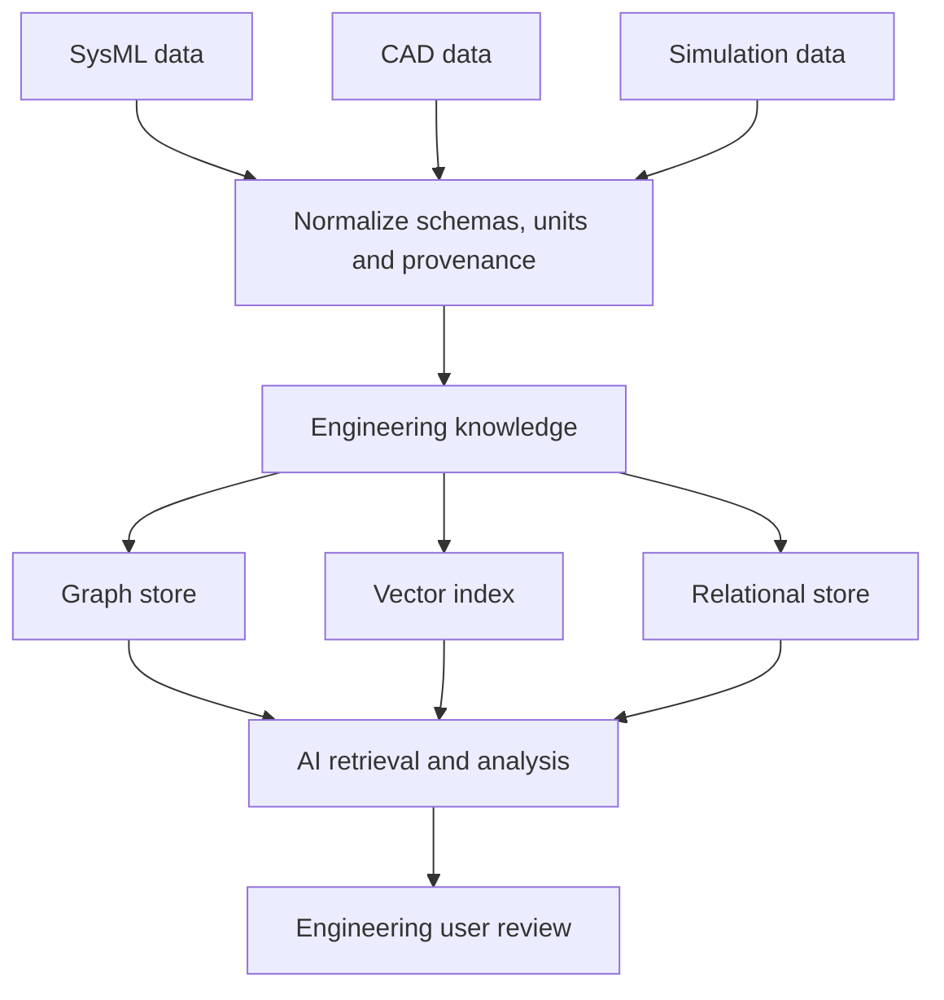
```mermaid
flowchart TB
    sysml["SysML data"] --> normalize["Normalize schemas, units and provenance"]
    cad["CAD data"] --> normalize
    sim["Simulation data"] --> normalize
    normalize --> knowledge["Engineering knowledge"]
    knowledge --> knowledgeGraph["Graph store"]
    knowledge --> vector["Vector index"]
    knowledge --> relational["Relational store"]
    knowledgeGraph --> ai["AI retrieval and analysis"]
    vector --> ai
    relational --> ai
    ai --> user["Engineering user review"]
```

---

## 17. SysML / Model Transformation

A major capability of JFXENGINE should be model interoperability.

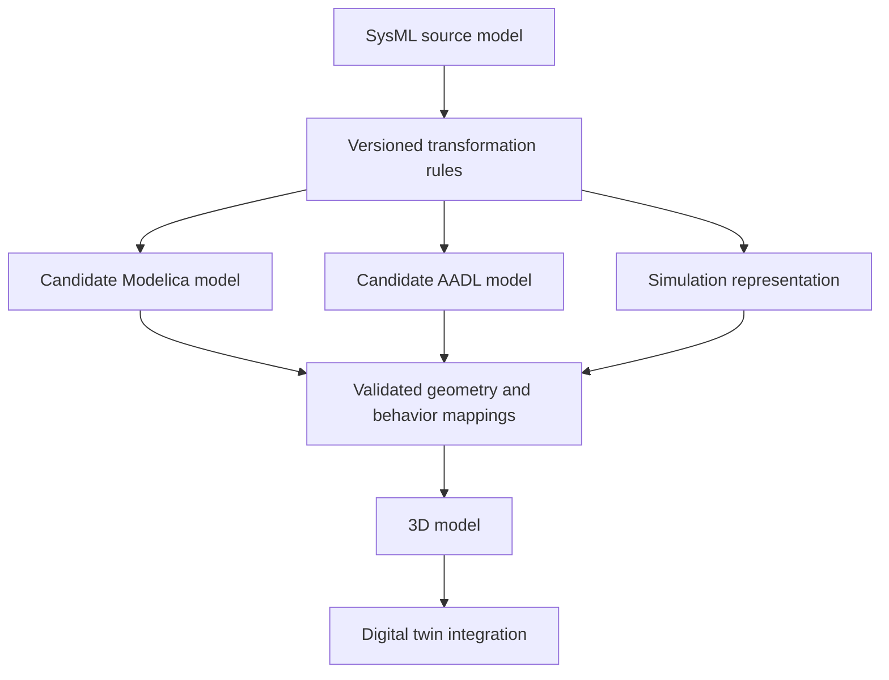
```mermaid
flowchart TB
    sysml["SysML source model"] --> transform["Versioned transformation rules"]
    transform --> modelica["Candidate Modelica model"]
    transform --> aadl["Candidate AADL model"]
    transform --> simulation["Simulation representation"]
    modelica --> mapping["Validated geometry and behavior mappings"]
    aadl --> mapping
    simulation --> mapping
    mapping --> scene["3D model"]
    scene --> twin["Digital twin integration"]
```

Possible transformation technologies include:

- ATL
- Acceleo
- Eclipse Modeling Framework
- SysML APIs
- Modelica interfaces
- XML/JSON interchange
- OpenUSD scene generation

---

## 18. CAD / CAM / CAS Integration

## CAD

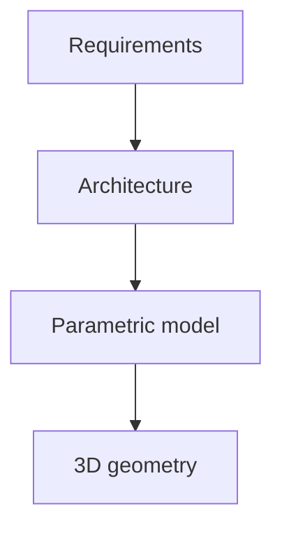
```mermaid
flowchart TB
    n0["Requirements"] --> n1
    n1["Architecture"] --> n2
    n2["Parametric model"] --> n3
    n3["3D geometry"]
```

## CAM

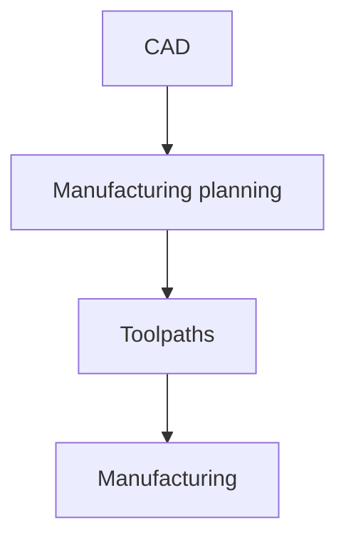
```mermaid
flowchart TB
    n0["CAD"] --> n1
    n1["Manufacturing planning"] --> n2
    n2["Toolpaths"] --> n3
    n3["Manufacturing"]
```

## CAS

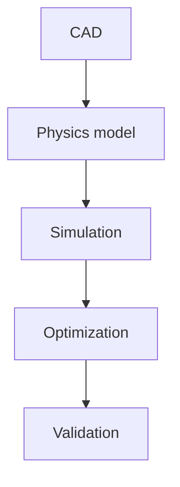
```mermaid
flowchart TB
    n0["CAD"] --> n1
    n1["Physics model"] --> n2
    n2["Simulation"] --> n3
    n3["Optimization"] --> n4
    n4["Validation"]
```

Together:

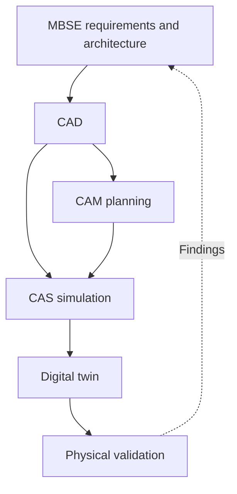
```mermaid
flowchart TB
    mbse["MBSE requirements and architecture"] --> cad["CAD"]
    cad --> cam["CAM planning"]
    cad --> cas["CAS simulation"]
    cam --> cas
    cas --> twin["Digital twin"]
    twin --> validation["Physical validation"]
    validation -. Findings .-> mbse
```

---

## 19. Digital Twin Architecture

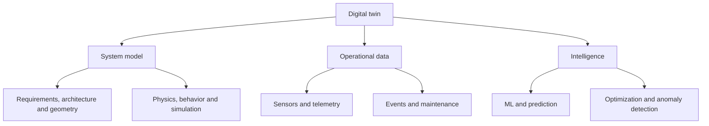
```mermaid
flowchart TB
    twin["Digital twin"] --> system["System model"]
    twin --> data["Operational data"]
    twin --> intelligence["Intelligence"]
    system --> structure["Requirements, architecture and geometry"]
    system --> behavior["Physics, behavior and simulation"]
    data --> telemetry["Sensors and telemetry"]
    data --> events["Events and maintenance"]
    intelligence --> prediction["ML and prediction"]
    intelligence --> optimize["Optimization and anomaly detection"]
```

---

## 20. Virtual Testing and Validation

JFXENGINE should support:

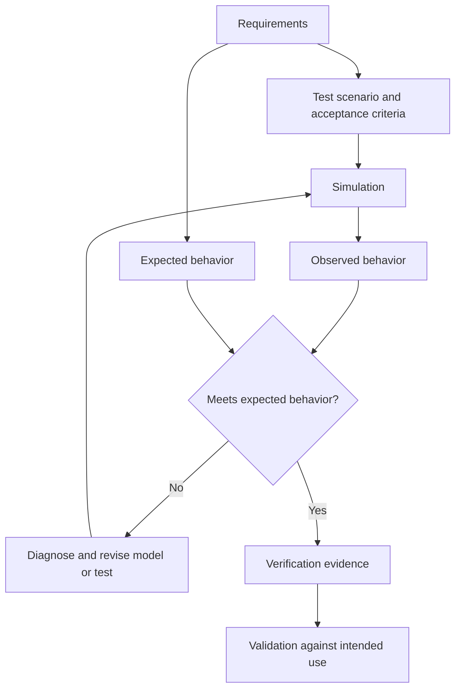
```mermaid
flowchart TB
    req["Requirements"] --> scenario["Test scenario and acceptance criteria"]
    scenario --> simulation["Simulation"]
    simulation --> observed["Observed behavior"]
    req --> expected["Expected behavior"]
    observed --> compare{"Meets expected behavior?"}
    expected --> compare
    compare -->|No| revise["Diagnose and revise model or test"]
    revise --> simulation
    compare -->|Yes| verification["Verification evidence"]
    verification --> validation["Validation against intended use"]
```

## Example

```yaml
scenario:
  name: autonomous_vehicle_test

environment:
  weather: controlled
  road: test_track

actors:
  ego_vehicle: autonomous
  pedestrian: simulated

requirements:
  - REQ-SAFETY-001
  - REQ-PERCEPTION-002

simulation:
  engine: TBD

outputs:
  telemetry: true
  video: true
  metrics: true

validation:
  status: pending
```

---

## 21. Repository Structure

Current documentation includes this README, the [documentation index](docs/README.md),
the linked roadmap and pipeline specification, and editable diagrams in
[MBSE/CAS/Drawio](MBSE/CAS/Drawio/).

The following is a **proposed target layout**, not a list of existing files:

```text
jfxengine/
│
├── README.md
├── LICENSE
├── CONTRIBUTING.md
├── CODE_OF_CONDUCT.md
│
├── docs/
│   │
│   ├── architecture/
│   │   ├── system-architecture.md
│   │   ├── mbse-architecture.md
│   │   ├── simulation-architecture.md
│   │   └── digital-twin-architecture.md
│   │
│   ├── dependencies/
│   │   ├── software-compendium.md
│   │   ├── dependency-template.md
│   │   ├── dependency-matrix.csv
│   │   └── licenses.md
│   │
│   ├── mbse/
│   │   ├── sysml.md
│   │   ├── arcadia.md
│   │   ├── aadl.md
│   │   └── model-transformation.md
│   │
│   ├── simulation/
│   │   ├── multiphysics.md
│   │   ├── multibody.md
│   │   └── validation.md
│   │
│   └── digital-twin/
│       ├── architecture.md
│       ├── telemetry.md
│       └── synchronization.md
│
├── src/
│   ├── core/
│   ├── visualization/
│   ├── mbse/
│   ├── sysml/
│   ├── simulation/
│   ├── digital-twin/
│   ├── ai/
│   └── interoperability/
│
├── models/
│   ├── sysml/
│   ├── modelica/
│   ├── cad/
│   ├── simulation/
│   └── digital-twin/
│
├── data/
│   ├── schemas/
│   ├── samples/
│   └── scenarios/
│
├── simulations/
│   ├── scenarios/
│   ├── results/
│   └── benchmarks/
│
├── tests/
│
├── infrastructure/
│   ├── docker/
│   ├── kubernetes/
│   └── terraform/
│
├── MBSE/
│   ├── CAD/
│   ├── CAM/
│   └── CAS/
│
└── examples/
    ├── sysml/
    ├── 3d/
    ├── simulation/
    └── digital-twin/
```

---

## 22. Installation Guide

Cloning and reading the documents is currently supported. The Python and Docker
commands below are future setup examples: `requirements.txt`, a Compose manifest
and application build files are not present in this repository snapshot.

### 22.1 Prerequisites

Recommended:

- Git
- JDK
- Maven or Gradle
- Python
- C/C++ compiler
- CMake
- Docker

Optional:

- Kubernetes
- Helm
- Terraform
- GPU/CUDA
- OpenUSD
- Modelica environment
- Capella
- OSATE

---

### 22.2 Clone

```bash
git clone https://github.com/sdk2035/jfxengine.git

cd jfxengine
```

---

### 22.3 Java Environment

```bash
java -version
```

The project should document the exact tested JDK and JavaFX versions once the build configuration is formally standardized.

OpenJFX provides official JavaFX build tooling for Maven and Gradle applications.

---

### 22.4 Python Environment

```bash
python -m venv .venv

source .venv/bin/activate

pip install -r requirements.txt
```

---

### 22.5 Docker

```bash
docker compose up -d
```

Recommended services:

- JFXENGINE
- AI Service
- Simulation Service
- Data Service
- Visualization Service
- Optional Database
- Optional Vector Store

---

## 23. Development Workflow

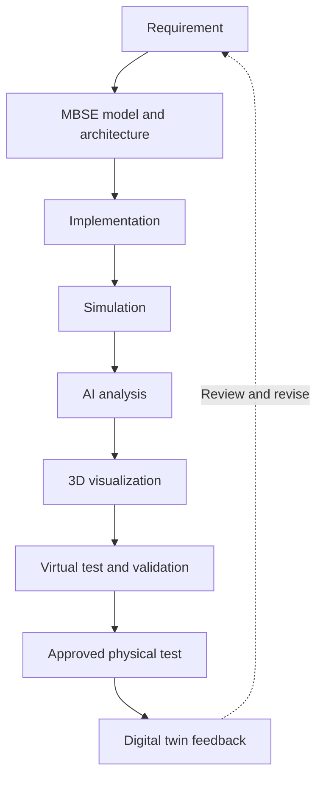
```mermaid
flowchart TB
    req["Requirement"] --> model["MBSE model and architecture"]
    model --> implementation["Implementation"]
    implementation --> simulation["Simulation"]
    simulation --> ai["AI analysis"]
    ai --> view["3D visualization"]
    view --> virtual["Virtual test and validation"]
    virtual --> physical["Approved physical test"]
    physical --> feedback["Digital twin feedback"]
    feedback -. Review and revise .-> req
```

---

## 24. Security

Engineering systems may contain proprietary technical information.

Security requirements include:

- Authentication.
- Role-based access control.
- Encryption.
- Secure APIs.
- Secrets management.
- Audit logging.
- Dependency scanning.
- SBOM generation.
- Vulnerability management.
- Secure model repositories.
- Protected simulation data.
- Access-controlled digital twins.

Recommended tools:

- OWASP Dependency-Check
- Trivy
- Syft
- Grype
- GitHub Dependabot
- SAST
- DAST
- SBOM

---

## 25. Responsible AI

AI-generated engineering outputs must remain subject to engineering review.

The platform should distinguish:

**AI suggestions are not engineering approval.**

For safety-critical applications:

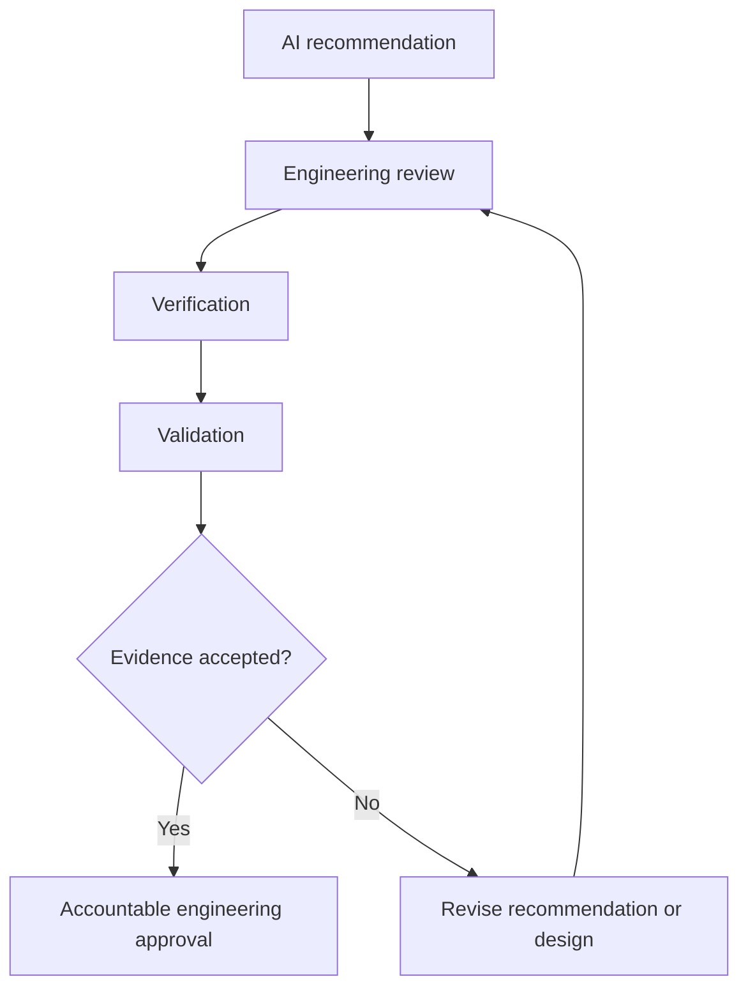
```mermaid
flowchart TB
    ai["AI recommendation"] --> review["Engineering review"]
    review --> verification["Verification"]
    verification --> validation["Validation"]
    validation --> gate{"Evidence accepted?"}
    gate -->|Yes| approval["Accountable engineering approval"]
    gate -->|No| revision["Revise recommendation or design"]
    revision --> review
```

AI must not independently certify safety-critical systems.

---

## 26. Roadmap

The seven capability milestones below complement the [four-phase delivery process](docs/roadmap/four-phase-engineering-delivery-plan.md).
The process organizes engineering work; these milestones organize platform capabilities.
The [domain ingestion specification](docs/architecture/domain-ingestion-pipelines.md)
defines the proposed transformation workstreams and their validation boundaries.

## Phase 1 — Repository Foundation

- Dependency catalog
- Documentation
- Architecture
- Build reproducibility
- License inventory

## Phase 2 — JavaFX / 3D Foundation

- 3D scene management
- Model loading
- Visualization
- Interaction

## Phase 3 — MBSE

- SysML integration
- Architecture models
- Requirements
- Traceability
- Model transformation

## Phase 4 — Simulation

- Modelica
- Multibody
- Multiphysics
- Scenario simulation

## Phase 5 — Digital Twin

- Telemetry
- Synchronization
- 3D operational visualization
- Simulation coupling

## Phase 6 — AI Engineering

- Engineering NLP
- Knowledge graph
- RAG
- LLM assistant
- Surrogate models
- PINNs
- Optimization

## Phase 7 — Industrial Platform

- Docker
- Kubernetes
- CI/CD
- Observability
- Security
- Multi-user collaboration

---

## 27. Contribution

The project follows a structured contribution model inspired by the reference repository template.

The contribution process should include:

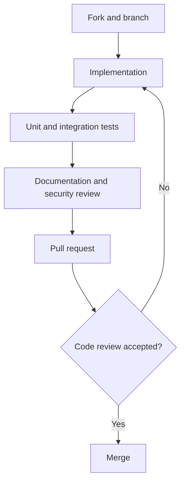
```mermaid
flowchart TB
    fork["Fork and branch"] --> implementation["Implementation"]
    implementation --> tests["Unit and integration tests"]
    tests --> docs["Documentation and security review"]
    docs --> pr["Pull request"]
    pr --> review{"Code review accepted?"}
    review -->|No| implementation
    review -->|Yes| merge["Merge"]
```

New dependencies must document:

- Purpose.
- Repository.
- License.
- Version.
- Installation.
- Runtime requirements.
- Integration method.
- Input/output formats.
- Security implications.
- Data implications.
- Performance.
- Maintenance status.

---

## 28. Governance

## Dependency Lifecycle

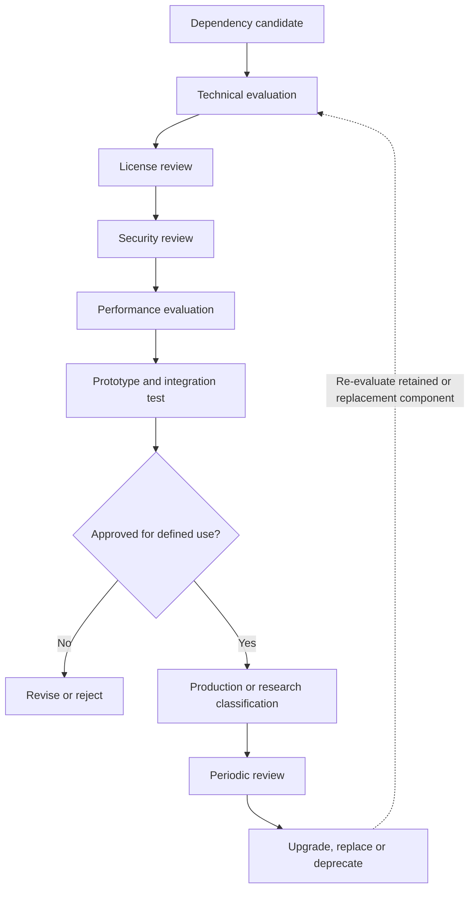
```mermaid
flowchart TB
    candidate["Dependency candidate"] --> technical["Technical evaluation"]
    technical --> license["License review"]
    license --> security["Security review"]
    security --> performance["Performance evaluation"]
    performance --> prototype["Prototype and integration test"]
    prototype --> decision{"Approved for defined use?"}
    decision -->|No| reject["Revise or reject"]
    decision -->|Yes| lifecycle["Production or research classification"]
    lifecycle --> periodic["Periodic review"]
    periodic --> action["Upgrade, replace or deprecate"]
    action -. Re-evaluate retained or replacement component .-> technical
```

## Architecture Governance

Every major component should have:

- Owner
- Purpose
- Interface
- Dependencies
- License
- Version
- Security Status
- Test Status
- Maintenance Status

---

## 29. License

Each external project must retain its original license and attribution.

The repository should maintain:

`docs/dependencies/licenses.md` (proposed inventory path)

containing:

- Dependency name.
- License.
- Version.
- Copyright.
- Repository.
- Compatibility assessment.

No external dependency should be promoted to a production component without license and security review.

---

## 30. Strategic Vision

JFXENGINE can evolve into an open-source **AI Digital Engineering Platform** connecting:

```mermaid
flowchart TB
    req["Requirements"] --> mbse["MBSE / SysML"]
    mbse --> architecture["System architecture"]
    architecture --> cad["CAD and CAM"]
    architecture --> ai["Engineering AI"]
    cad --> cas["CAS and simulation"]
    ai --> cas
    cas --> twin["Digital twin"]
    twin --> view["3D / VR / AR"]
    view --> virtual["Virtual testing"]
    virtual --> physical["Reviewed physical-system deployment"]
    physical --> operation["Operational data"]
    operation --> twin
```

## Final Vision

JFXENGINE should become a reusable open-source foundation for:

**Model-Based Systems Engineering + AI + 3D Visualization + Simulation + Digital Twins + Virtual Validation.**

Its long-term architectural value comes from connecting traditionally separated engineering disciplines into a common digital thread:

```mermaid
flowchart TB
    req["Requirements"] --> architecture["Architecture and models"]
    architecture --> geometry["Geometry"]
    geometry --> sim["Simulation and AI analysis"]
    sim --> twin["Digital twin"]
    twin --> validation["Virtual validation"]
    validation --> physical["Approved physical system"]
    physical --> data["Operational data"]
    data --> twin
    data -. Reviewed change request .-> req
```

This makes JFXENGINE suitable as a research and engineering foundation for advanced domains such as aerospace, robotics, automotive, industrial automation, energy, manufacturing, autonomous systems and complex cyber-physical systems.

---

## References

- JFXENGINE repository — AI-Powered MBSE 3D Visualization Platform.
- `sdk2035/Plantilla-de-repositorio` — repository documentation template based on the BID/EL-BID template.
- OpenJFX — official OpenJFX project and build tooling.
- FXGL — JavaFX game/3D framework reference.
- RichTextFX — JavaFX rich-text component ecosystem reference.
