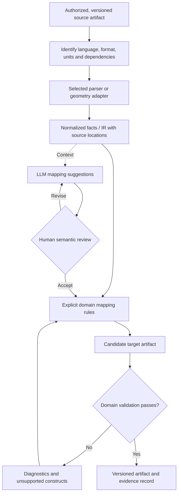
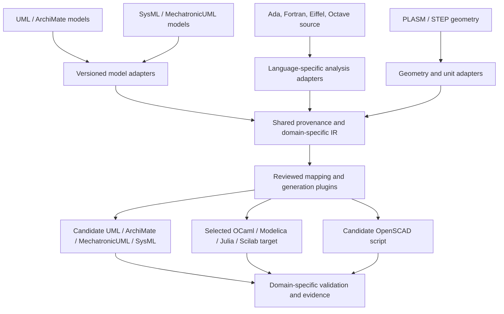

# Domain Ingestion Pipeline Specification

[Documentation index](../README.md) · [Project overview](../../README.md)

## Scope and status

This document translates and structures the four domain pipelines in the former
Spanish draft. Rascal MPL and LLM-assisted analysis are proposed mechanisms;
this repository does not yet provide parsers, trained models, adapters or verified
transformations for these pairs.

The source used bidirectional arrows. Here they express candidate directions for
separate investigation, not a guarantee of automatic, lossless round trips.
Each direction requires an explicit mapping and its own acceptance cases.

## Contents

- [Domain contracts](#domain-contracts)
- [Shared ingestion workflow](#shared-ingestion-workflow)
- [Adapter architecture](#adapter-architecture)
- [Validation by domain](#validation-by-domain)
- [Transformation record](#transformation-record)
- [Delivery integration](#delivery-integration)

## Domain contracts

| Workstream | Source and candidate target families | Proposed mechanism | Mapping boundary |
| --- | --- | --- | --- |
| Low-Code | UML and ArchiMate, each direction evaluated separately | Rascal-based extraction of structural domain facts; LLM-assisted proposals for enterprise-architecture mappings | Select metamodel versions and map only supported concepts; retain unmatched elements and traceability |
| Legacy to Modern | Ada, Fortran, Eiffel and Octave; selected targets among OCaml, Modelica, Julia and Scilab | Language-specific grammars and static analysis; reviewed AI-assisted semantic translation | Select a concrete source/target pair; these lists do not establish support for every combination |
| Modelica AI | SysML and MechatronicUML | Requirements-oriented LLM assistance for mapping block-model information to proposed cyber-physical behavior specifications | Define behavior, timing, ports and constraints explicitly; structural diagrams alone do not specify executable behavior |
| AI4DIA CAD | PLASM and STEP; candidate OpenSCAD scripts | Syntax/geometry extraction with MPL tooling and AI-assisted parametric design proposals | A file-format/geometry adapter is required; inferred topology and parameters must be checked against source geometry |

“Modelica AI” is the inherited workstream name. Its specified pair is
SysML–MechatronicUML; generating Modelica is a separate proposed integration in the
[README model-transformation view](../../README.md#17-sysml--model-transformation).
“Specs LLM” in the source is a proposed requirements-analysis role, not a specified
product, model version or existing endpoint.

## Shared ingestion workflow



Parsing, semantic mapping and generation are separate stages. Preserve parse
errors, unresolved dependencies and unsupported constructs instead of silently
dropping them. AI suggestions enter the mapping only after review. Validation
failure returns an actionable diagnostic rather than an apparently completed
conversion.

## Adapter architecture



The shared layer provides provenance and diagnostics; it does not flatten every
domain into one universal executable language. An output node describes a target
family, not unrestricted conversion from every input. Reverse-direction adapters
must be designed and tested separately.

## Validation by domain

| Domain | Minimum proposed checks | Reported limitations |
| --- | --- | --- |
| Low-Code | Metamodel conformance, stable IDs, relationship coverage and reviewed sample mappings | Concepts without equivalents; lossy simplification; unsupported versions |
| Legacy to Modern | Parsing/type checks, executable fixtures where applicable, numerical tolerances, dependency coverage and behavioral comparisons | Runtime differences, unsupported language features, numerical precision and state semantics |
| Modelica AI | Requirement links, interface compatibility, state/transition coverage and explicit timing assumptions | Behavior inferred rather than specified; unresolved concurrency or physical semantics |
| AI4DIA CAD | Units, coordinate systems, topology checks, tolerances and geometry comparison | Lost features, approximations and unverified inferred parameters |

A reverse transformation needs additional round-trip tests using accepted
equivalence criteria. Successful parsing or compilation is not proof of semantic,
numerical or geometric equivalence.

## Transformation record

The following is a proposed record shape, not an implemented API:

```yaml
transformation:
  id: example-reviewed-mapping
  domain: low-code
  source:
    artifact: TBD
    revision: TBD
    format_version: TBD
  target:
    artifact: TBD
    format_version: TBD
  parser_version: TBD
  mapping_version: TBD
  direction: source-to-target
  ai_assistance:
    model_version: TBD
    prompt_revision: TBD
    reviewer: TBD
  evidence:
    source_links: []
    validation_cases: []
    unsupported_constructs: []
    known_losses: []
  status: proposed
```

Select authorized source material, retain its license/provenance, and define the
model-provider boundary before sending source artifacts to an external service.
Preserve reviewed mappings independently of a particular LLM so transformations
can be reproduced and compared across revisions.

## Delivery integration

Use [phase 1](../roadmap/four-phase-engineering-delivery-plan.md#phase-1-technical-conception-and-architecture)
to select one small source/target pair and its acceptance criteria. In phase 2,
prototype extraction and mapping. In phase 3, run domain-specific validation.
Only accepted, versioned adapters are candidates for a phase-4 pilot.

Source: `docs/Especificación de los.txt`, retained in Git history and recorded in
the [migration register](../README.md#source-migration-register).
