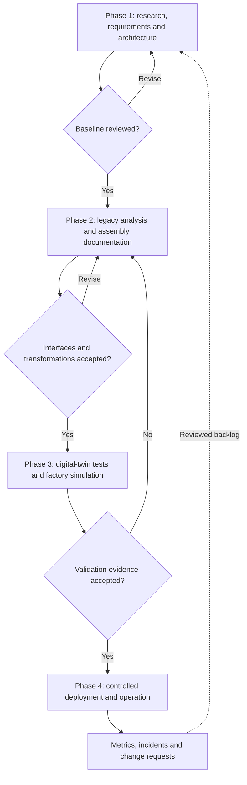
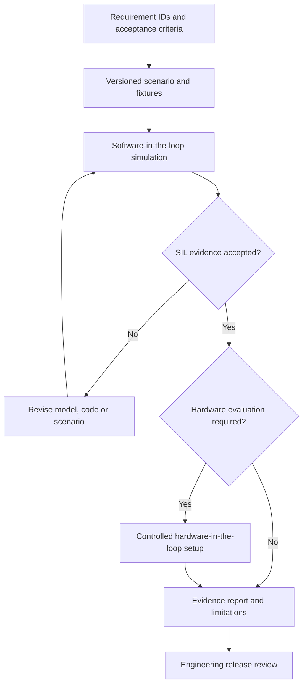

# Four-Phase Engineering Delivery Plan

[Documentation index](../README.md) · [Project overview](../../README.md)

## Purpose and status

This proposal translates the ten activities in the former Spanish four-phase
draft into a reviewable engineering process. It covers technical conception,
legacy-code analysis, assembly, virtual validation and potential cloud operation.
It defines intended work and acceptance evidence, not completed implementation,
delivery dates or established commercial services.

## Contents

- [Delivery workflow](#delivery-workflow)
- [Phase 1: technical conception and architecture](#phase-1-technical-conception-and-architecture)
- [Phase 2: refactoring, transformation and assembly](#phase-2-refactoring-transformation-and-assembly)
- [Phase 3: virtual validation and simulation](#phase-3-virtual-validation-and-simulation)
- [Phase 4: deployment and continuous operation](#phase-4-deployment-and-continuous-operation)
- [Relationship to the platform roadmap](#relationship-to-the-platform-roadmap)

## Delivery workflow

## Phase 1: technical conception and architecture

| Step | Activity | Reviewable output |
| --- | --- | --- |
| 1 | Refactor research descriptions with AI assistance; translate mathematical and robotics concepts into explicit requirements | Source-linked requirements, definitions, assumptions and unresolved questions |
| 2 | Propose a modular architecture with JavaFX/JFXCMS presentation, a control-logic engine and a driver layer | Component responsibilities, interfaces and deployment boundaries |
| 3 | Update the work plan with user stories, sprints, effort estimates and dependencies | Prioritized backlog with estimate assumptions and accountable owners |
| 4 | Produce high-level technical specifications | System requirements specification, API contracts, security requirements and hardware interlock requirements |
| 5 | Draft high-level class/sequence views and establish the review method | Reviewed models, static-analysis rules and an AI-assisted code-review process |

AI-generated requirements and estimates need human review. Trace each architecture
decision to an accepted requirement. The proposed JavaFX/JFXCMS integration is an
interface to evaluate, not a dependency already installed by this repository.
Mermaid communicates the workflow; formal UML interchange, if needed, requires
its own model and tooling.

**Phase exit:** reviewers accept the requirement baseline, interfaces, risk
questions and work plan, or return specific items for revision.

## Phase 2: refactoring, transformation and assembly

| Step | Activity | Reviewable output |
| --- | --- | --- |
| 6 | Analyze legacy C/C++ and laboratory code; propose normalized intermediate representations for local model analysis or training | Versioned source inventory, grammar coverage, source locations, IR schema and semantic comparison examples |
| 7 | Extend assembly and integration documentation | Reviewed physical integration instructions, pin mappings, sensor connectivity and industrial/ROS protocol contracts |

The draft's “training metalanguage” is not yet a defined language or executable
toolchain. Select a schema and language-specific parsers before claiming source
coverage. Keep executable behavior tests separate from training-data preparation;
an IR does not itself establish equivalent behavior or rights to train on code.
The [pipeline specification](../architecture/domain-ingestion-pipelines.md)
describes related domain adapters and validation records.

Assembly material must name the hardware revision and distinguish proposed wiring
from reviewed manufacturer specifications. Record units, timing, error handling
and interlocks at driver boundaries before integrating physical devices.

**Phase exit:** a small authorized source sample can be traced through its IR and
candidate output, and assembly/interface documents have a recorded review.

## Phase 3: virtual validation and simulation

| Step | Activity | Reviewable output |
| --- | --- | --- |
| 8 | Define digital-twin integration tests for latency, kinematics and safety requirements; plan software-in-the-loop and hardware-in-the-loop separately | Versioned scenarios, expected results, measured results and requirement coverage |
| 9 | Simulate an integrated open-factory production scenario; examine bottlenecks and execution performance | Plant assumptions, workload definition, throughput/latency results and sensitivity analysis |

Hardware-in-the-loop requires actual hardware and controlled interfaces; a virtual
replica alone is not an HIL setup. Simulation evidence should state model fidelity,
solver/runtime versions, timestep assumptions and limits on physical conclusions.

**Phase exit:** results meet explicitly selected criteria; deviations and residual
risks have owners. Virtual validation alone does not authorize physical deployment.

## Phase 4: deployment and continuous operation

| Step | Activity | Reviewable output |
| --- | --- | --- |
| 10 | Evaluate cloud SaaS/PaaS subscriptions, multi-tenant delivery, licensing, metrics and real-time integration | Deployment proposal, tenant-isolation design, service scope, license inventory, monitoring and recovery plan |

Validate deployment feasibility and demand with a scoped pilot before describing
subscription services as available. Document access boundaries, retention, cost
assumptions, support ownership and rollback. Feed operational findings back into
requirements and tests through reviewed changes.

**Phase exit:** the pilot has an accepted service scope, operational owner and
evidence-based decision to expand, revise or stop.

## Relationship to the platform roadmap

| Delivery phase | Relevant README capability milestones |
| --- | --- |
| 1. Conception | Repository foundation, MBSE and architecture |
| 2. Transformation and assembly | JavaFX/3D, model integration and simulation interfaces |
| 3. Virtual validation | Simulation, digital twins and reviewed AI analysis |
| 4. Operation | Industrial-platform infrastructure and continued governance |

The [seven-stage platform roadmap](../../README.md#26-roadmap) is not replaced by
these four process phases. Capabilities can mature through repeated delivery cycles.

Source: `docs/Detalle de las 4 Fases.txt`, retained in Git history and recorded in
the [migration register](../README.md#source-migration-register).
